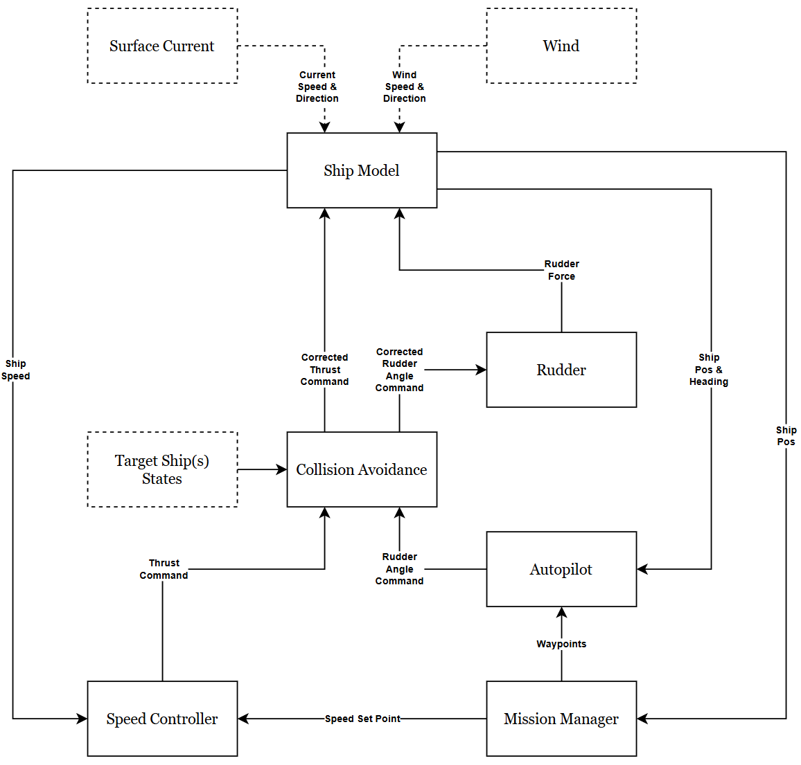

# Simplified Ship FMUs

## Ship Dynamics
These collection of FMUs are required to build a simplified ship without machinery system dynamic. This ship type ideally is used to be the target ships or obstacles for the future testing algorithms. The ship model simulates motion in **three degrees of freedom**:

- **Surge**
- **Sway**
- **Yaw**

### State Variables

The full system state includes:

- `x_N`: North position [m]
- `y_E`: East position [m]
- `ψ`: Yaw angle [rad]
- `u`: Surge velocity [m/s]
- `v`: Sway velocity [m/s]
- `r`: Yaw rate (turn rate) [rad/s]

> ⚠️ **ANGLE IN NED FRAME**
>
> When we first initiate the ship heading, `0°` starts from `NORTH (y+)` direction. **Positive heading** is clockwise in direction.

**Additional states** (depending on machinery system model):
- `T`: Thrust force [N] — for simplified model

### Forces Modeled

- Inertial forces  
- Added mass effects  
- Coriolis forces  
- Linear and nonlinear damping  
- Environmental forces (wind and current)  
- Control forces (thrust & rudder)

## Speed Control
**Direct Speed Controller**: Regulates thrust forces send to the `ShipModel` to maintain desired vessel speed

## Navigation System
- **Waypoint Controller**: 
Follows a sequence of waypoints using Line of Sight (LOS) guidance, combined with PID controller to become the Autopilot system.

# FMUs Description
## Autopilot FMU

### Inputs
| Attribute Name | Default Value | Description | Type |
|----------------|--------------|-------------|------|
| `north` |  | Current ship north position (global coordinate). | `REAL` |
| `east` |  | Current ship east position (global coordinate). | `REAL` |
| `yaw_angle_rad` |  | Current ship yaw angle (heading) in radians. | `REAL` |
| `next_wp_north` |  | North coordinate of the next waypoint. | `REAL` |
| `next_wp_east` |  | East coordinate of the next waypoint. | `REAL` |
| `prev_wp_north` |  | North coordinate of the previous waypoint. | `REAL` |
| `prev_wp_east` |  | East coordinate of the previous waypoint. | `REAL` |

### Outputs
| Attribute Name | Default Value | Description | Type |
|----------------|--------------|-------------|------|
| `yaw_angle_ref_rad` |  | Reference heading generated by the LOS guidance algorithm (radians). | `REAL` |
| `rudder_angle_deg` |  | Rudder angle command generated by the autopilot (degrees). | `REAL` |
| `e_ct` |  | Cross-track error relative to the desired path. | `REAL` |

### Parameters
| Attribute Name | Default Value | Description | Type |
|----------------|--------------|-------------|------|
| `r` | 1000 | Lookahead distance used in the LOS guidance algorithm. | `REAL` |
| `ki_ct` | 0.002 | Integral gain for cross-track error compensation. | `REAL` |
| `integrator_limit` | 5000 | Limit for the cross-track error integrator to prevent windup. | `REAL` |
| `kp` | 1.5 | Proportional gain of the autopilot PID controller. | `REAL` |
| `ki` | 0.00015 | Integral gain of the autopilot PID controller. | `REAL` |
| `kd` | 80.0 | Derivative gain of the autopilot PID controller. | `REAL` |
| `max_rudder_rate_deg_per_sec` | 2.3 | Maximum allowed rudder rate (degrees per second). | `REAL` |
| `max_rudder_angle_deg` | 30 | Maximum allowed rudder angle (degrees). | `REAL` |

---

## Speed Controller FMU

### Inputs
| Attribute Name | Default Value | Description | Type | Type |
|----------------|--------------|-------------|------|------|
| `desired_ship_speed` |  | Desired ship speed command from the mission manager or higher-level controller. | `REAL` |
| `measured_ship_speed` |  | Measured ship speed from the ship dynamics model. | `REAL` |

### Outputs
| Attribute Name | Default Value | Description | Type |
|----------------|--------------|-------------|------|
| `thrust_force` |  | Propulsive thrust force command generated by the speed controller. | `REAL` |

### Parameters
| Attribute Name | Default Value | Description | Type |
|----------------|--------------|-------------|------|
| `kp` | 150.0 | Proportional gain of the PID speed controller. | `REAL` |
| `ki` | 350.0 | Integral gain of the PID speed controller. | `REAL` |
| `kd` | 200.0 | Derivative gain of the PID speed controller. | `REAL` |

---

## Rudder Model FMU

### Inputs
| Attribute Name | Default Value | Description | Type |
|----------------|--------------|-------------|------|
| `rudder_angle_deg` |  | Rudder angle command applied to the rudder (degrees). | `REAL` |
| `yaw_angle_rad` |  | Current yaw angle (heading) of the ship in radians. | `REAL` |
| `forward_speed` |  | Ship forward speed relative to the water. | `REAL` |
| `current_speed` |  | Magnitude of the environmental current affecting the vessel. | `REAL` |
| `current_dir_rad` |  | Direction of the environmental current in radians. | `REAL` |

### Outputs
| Attribute Name | Default Value | Description | Type |
|----------------|--------------|-------------|------|
| `rudder_force_v` |  | Lateral (sway) force generated by the rudder. | `REAL` |
| `rudder_force_r` |  | Yaw moment generated by the rudder. | `REAL` |

### Parameters
| Attribute Name | Default Value | Description | Type |
|----------------|--------------|-------------|------|
| `rudder_angle_to_sway_force_coefficient` | 50000 | Coefficient mapping rudder angle to generated sway force. | `REAL` |
| `rudder_angle_to_yaw_force_coefficient` | 500000 | Coefficient mapping rudder angle to generated yaw moment. | `REAL` |
| `max_rudder_angle_negative_deg` | -30 | Maximum allowable rudder angle in the negative direction (degrees). | `REAL` |
| `max_rudder_angle_positive_deg` | 30 | Maximum allowable rudder angle in the positive direction (degrees). | `REAL` |

---

## Collision Avoidance FMU

### Inputs
| Attribute Name | Default Value | Description | Type |
|----------------|--------------|-------------|------|
| `throttle_cmd` |  | Original throttle command from the propulsion controller. | `REAL` |
| `rudder_angle_deg` |  | Original rudder command from the autopilot controller (degrees). | `REAL` |
| `own_north` |  | Own ship north position in the global coordinate frame. | `REAL` |
| `own_east` |  | Own ship east position in the global coordinate frame. | `REAL` |
| `own_yaw_angle` |  | Own ship heading angle in radians. | `REAL` |
| `own_measured_speed` |  | Own ship measured speed. | `REAL` |
| `tar_1_north` |  | Target ship 1 north position. | `REAL` |
| `tar_1_east` |  | Target ship 1 east position. | `REAL` |
| `tar_1_yaw_angle` |  | Target ship 1 heading angle. | `REAL` |
| `tar_1_measured_speed` |  | Target ship 1 speed. | `REAL` |
| `tar_2_north` |  | Target ship 2 north position. | `REAL` |
| `tar_2_east` |  | Target ship 2 east position. | `REAL` |
| `tar_2_yaw_angle` |  | Target ship 2 heading angle. | `REAL` |
| `tar_2_measured_speed` |  | Target ship 2 speed. | `REAL` |
| `tar_3_north` |  | Target ship 3 north position. | `REAL` |
| `tar_3_east` |  | Target ship 3 east position. | `REAL` |
| `tar_3_yaw_angle` |  | Target ship 3 heading angle. | `REAL` |
| `tar_3_measured_speed` |  | Target ship 3 speed. | `REAL` |

### Outputs
| Attribute Name | Default Value | Description | Type |
|----------------|--------------|-------------|------|
| `new_throttle_cmd` |  | Modified throttle command after collision avoidance logic. | `REAL` |
| `new_rudder_angle_deg` |  | Modified rudder angle command after collision avoidance logic. | `REAL` |
| `colav_rud_ang_increment` |  | Rudder angle increment applied by the collision avoidance system. | `REAL` |
| `colav_active` |  | Boolean flag indicating whether collision avoidance is currently active. | `BOOLEAN` |
| `ship_collision` |  | Boolean flag indicating that a collision has occurred. | `BOOLEAN` |
| `beta_own_to_tar_1` |  | Relative bearing from own ship to target ship 1. | `REAL` |
| `tcpa_own_to_tar_1` |  | Time to closest point of approach (TCPA) with target ship 1. | `REAL` |
| `dcpa_own_to_tar_1` |  | Distance at closest point of approach (DCPA) with target ship 1. | `REAL` |
| `dist_own_to_tar_1` |  | Current distance between own ship and target ship 1. | `REAL` |
| `rr_own_to_tar_1` |  | Relative speed between own ship and target ship 1. | `REAL` |
| `beta_own_to_tar_2` |  | Relative bearing from own ship to target ship 2. | `REAL` |
| `tcpa_own_to_tar_2` |  | Time to closest point of approach (TCPA) with target ship 2. | `REAL` |
| `dcpa_own_to_tar_2` |  | Distance at closest point of approach (DCPA) with target ship 2. | `REAL` |
| `dist_own_to_tar_2` |  | Current distance between own ship and target ship 2. | `REAL` |
| `rr_own_to_tar_2` |  | Relative speed between own ship and target ship 2. | `REAL` |
| `beta_own_to_tar_3` |  | Relative bearing from own ship to target ship 3. | `REAL` |
| `tcpa_own_to_tar_3` |  | Time to closest point of approach (TCPA) with target ship 3. | `REAL` |
| `dcpa_own_to_tar_3` |  | Distance at closest point of approach (DCPA) with target ship 3. | `REAL` |
| `dist_own_to_tar_3` |  | Current distance between own ship and target ship 3. | `REAL` |
| `rr_own_to_tar_3` |  | Relative speed between own ship and target ship 3. | `REAL` |

### Parameters
| Attribute Name | Default Value | Description | Type |
|----------------|--------------|-------------|------|
| `throttle_scale_factor` | 0.5 | Scaling factor applied to throttle during collision avoidance. | `REAL` |
| `rud_ang_increment_deg` | 0.2 | Incremental rudder angle applied for evasive maneuvering (degrees). | `REAL` |
| `danger_zone_radius` | 926.0 | Radius defining the danger zone around the own ship. | `REAL` |
| `collision_zone_radius` | 100.0 | Radius defining the collision zone where a collision is considered imminent. | `REAL` |
| `max_target_ship_count` | 3 | Maximum number of target ships considered by the collision avoidance system. | `INTEGER` |
| `hold_time` | 450.0 | Maximum time to prioritize and track a single target ship during avoidance. | `REAL` |
| `T_lookahead` | 900.0 | Lookahead time horizon used for predicting potential collisions (seconds). | `REAL` |

---

## Ship Model FMU

### Inputs
| Attribute Name | Default Value | Description | Type |
|----------------|--------------|-------------|------|
| `thrust_force` |  | Propulsive thrust force generated by the propulsion system. | `REAL` |
| `rudder_force_v` |  | Lateral (sway) force generated by the rudder. | `REAL` |
| `rudder_force_r` |  | Yaw moment generated by the rudder. | `REAL` |
| `wind_speed` |  | Magnitude of the wind affecting the vessel. | `REAL` |
| `wind_dir_rad` |  | Direction of the wind in radians. | `REAL` |
| `current_speed` |  | Magnitude of the ocean current affecting the vessel. | `REAL` |
| `current_dir_rad` |  | Direction of the ocean current in radians. | `REAL` |

### Outputs
| Attribute Name | Default Value | Description | Type |
|----------------|--------------|-------------|------|
| `north` |  | Ship north position in the global coordinate frame. | `REAL` |
| `east` |  | Ship east position in the global coordinate frame. | `REAL` |
| `yaw_angle_rad` |  | Ship yaw angle (heading) in radians. | `REAL` |
| `forward_speed` |  | Ship forward velocity in the body frame. | `REAL` |
| `sideways_speed` |  | Ship lateral (sway) velocity in the body frame. | `REAL` |
| `yaw_rate` |  | Ship yaw angular velocity (rad/s). | `REAL` |
| `total_ship_speed` |  | Total ship speed magnitude. | `REAL` |
| `d_north` |  | Time derivative of the north position. | `REAL` |
| `d_east` |  | Time derivative of the east position. | `REAL` |
| `d_yaw_angle_rad` |  | Time derivative of the yaw angle. | `REAL` |
| `d_forward_speed` |  | Time derivative of the forward velocity. | `REAL` |
| `d_sideways_speed` |  | Time derivative of the sideways velocity. | `REAL` |
| `d_yaw_rate` |  | Time derivative of the yaw rate. | `REAL` |

### Parameters
| Attribute Name | Default Value | Description | Type |
|----------------|--------------|-------------|------|
| `dead_weight_tonnage` | 3850000 | Deadweight tonnage of the vessel. | `REAL` |
| `coefficient_of_deadweight_to_displacement` | 0.7 | Conversion coefficient from deadweight to displacement mass. | `REAL` |
| `bunkers` | 200000 | Mass of fuel stored onboard. | `REAL` |
| `ballast` | 200000 | Mass of ballast carried by the vessel. | `REAL` |
| `length_of_ship` | 80 | Overall ship length. | `REAL` |
| `width_of_ship` | 16 | Ship beam (width). | `REAL` |
| `added_mass_coefficient_in_surge` | 0.4 | Added mass coefficient in surge direction. | `REAL` |
| `added_mass_coefficient_in_sway` | 0.4 | Added mass coefficient in sway direction. | `REAL` |
| `added_mass_coefficient_in_yaw` | 0.4 | Added mass coefficient in yaw motion. | `REAL` |
| `mass_over_linear_friction_coefficient_in_surge` | 130 | Linear friction parameter in surge. | `REAL` |
| `mass_over_linear_friction_coefficient_in_sway` | 18 | Linear friction parameter in sway. | `REAL` |
| `mass_over_linear_friction_coefficient_in_yaw` | 90 | Linear friction parameter in yaw. | `REAL` |
| `nonlinear_friction_coefficient_in_surge` | 2400 | Nonlinear hydrodynamic friction coefficient in surge. | `REAL` |
| `nonlinear_friction_coefficient_in_sway` | 4000 | Nonlinear hydrodynamic friction coefficient in sway. | `REAL` |
| `nonlinear_friction_coefficient_in_yaw` | 400 | Nonlinear hydrodynamic friction coefficient in yaw. | `REAL` |
| `rho_seawater` | 1025 | Density of seawater used in hydrodynamic calculations. | `REAL` |
| `rho_air` | 1.2 | Density of air used for wind force calculations. | `REAL` |
| `g` | 9.81 | Gravitational acceleration constant. | `REAL` | `REAL` |
| `front_above_water_height` | 8 | Effective frontal height of the ship above the waterline for wind loading. | `REAL` |
| `side_above_water_height` | 8 | Effective side height of the ship above the waterline for wind loading. | `REAL` |
| `cx` | 0.5 | Aerodynamic drag coefficient in surge direction. | `REAL` |
| `cy` | 0.7 | Aerodynamic drag coefficient in sway direction. | `REAL` |
| `cn` | 0.08 | Aerodynamic yaw moment coefficient. | `REAL` |
| `initial_north_position_m` |  | Initial north position of the ship. | `REAL` |
| `initial_east_position_m` |  | Initial east position of the ship. | `REAL` |
| `initial_yaw_angle_rad` |  | Initial ship heading angle in radians. | `REAL` |
| `initial_forward_speed_m_per_s` | 0.0 | Initial forward speed of the ship. | `REAL` |
| `initial_sideways_speed_m_per_s` | 0.0 | Initial sideways speed of the ship. | `REAL` |
| `initial_yaw_rate_rad_per_s` | 0.0 | Initial yaw angular velocity. | `REAL` |
 
---

## Mission Manager FMU

### Inputs
| Attribute Name | Default Value | Description | Type |
|----------------|--------------|-------------|------|
| `north` |  | Current ship north position in the global coordinate frame. | `REAL` |
| `east` |  | Current ship east position in the global coordinate frame. | `REAL` |

### Outputs

| Attribute Name | Default Value | Description | Type |
|----------------|--------------|-------------|------|
| `prev_wp_north` |  | North coordinate of the previous active waypoint. | `REAL` |
| `prev_wp_east` |  | East coordinate of the previous active waypoint. | `REAL` |
| `prev_wp_speed` |  | Target speed associated with the previous active waypoint. | `REAL` |
| `next_wp_north` |  | North coordinate of the next active waypoint. | `REAL` |
| `next_wp_east` |  | East coordinate of the next active waypoint. | `REAL` |
| `next_wp_speed` |  | Target speed associated with the next active waypoint. | `REAL` |
| `last_wp_active` |  | Boolean flag indicating that the current target waypoint is the final waypoint in the route. | `BOOLEAN` |
| `reach_wp_end` |  | Boolean flag indicating that the end waypoint has been reached. | `BOOLEAN` |

### Parameters

| Attribute Name | Default Value | Description | Type |
|----------------|--------------|-------------|------|
| `ra` | 300 | Radius of acceptance used to determine when a waypoint is considered reached. | `REAL` |
| `max_inter_wp` | 8 | Maximum number of intermediate waypoints supported by the mission manager. | `INTEGER` |
| `wp_start_north` |  | North coordinate of the start waypoint. | `REAL` |
| `wp_start_east` |  | East coordinate of the start waypoint. | `REAL` |
| `wp_start_speed` |  | Target speed associated with the start waypoint. | `REAL` |
| `wp_1_north` |  | North coordinate of intermediate waypoint 1. | `REAL` |
| `wp_1_east` |  | East coordinate of intermediate waypoint 1. | `REAL` |
| `wp_1_speed` |  | Target speed associated with intermediate waypoint 1. | `REAL` |
| `wp_2_north` |  | North coordinate of intermediate waypoint 2. | `REAL` |
| `wp_2_east` |  | East coordinate of intermediate waypoint 2. | `REAL` |
| `wp_2_speed` |  | Target speed associated with intermediate waypoint 2. | `REAL` |
| `wp_3_north` |  | North coordinate of intermediate waypoint 3. | `REAL` |
| `wp_3_east` |  | East coordinate of intermediate waypoint 3. | `REAL` |
| `wp_3_speed` |  | Target speed associated with intermediate waypoint 3. | `REAL` |
| `wp_4_north` |  | North coordinate of intermediate waypoint 4. | `REAL` |
| `wp_4_east` |  | East coordinate of intermediate waypoint 4. | `REAL` |
| `wp_4_speed` |  | Target speed associated with intermediate waypoint 4. | `REAL` |
| `wp_5_north` |  | North coordinate of intermediate waypoint 5. | `REAL` |
| `wp_5_east` |  | East coordinate of intermediate waypoint 5. | `REAL` |
| `wp_5_speed` |  | Target speed associated with intermediate waypoint 5. | `REAL` |
| `wp_6_north` |  | North coordinate of intermediate waypoint 6. | `REAL` |
| `wp_6_east` |  | East coordinate of intermediate waypoint 6. | `REAL` |
| `wp_6_speed` |  | Target speed associated with intermediate waypoint 6. | `REAL` |
| `wp_7_north` |  | North coordinate of intermediate waypoint 7. | `REAL` |
| `wp_7_east` |  | East coordinate of intermediate waypoint 7. | `REAL` |
| `wp_7_speed` |  | Target speed associated with intermediate waypoint 7. | `REAL` |
| `wp_8_north` |  | North coordinate of intermediate waypoint 8. | `REAL` |
| `wp_8_east` |  | East coordinate of intermediate waypoint 8. | `REAL` |
| `wp_8_speed` |  | Target speed associated with intermediate waypoint 8. | `REAL` |
| `wp_end_north` |  | North coordinate of the final waypoint. | `REAL` |
| `wp_end_east` |  | East coordinate of the final waypoint. | `REAL` |
| `wp_end_speed` |  | Target speed associated with the final waypoint. | `REAL` |