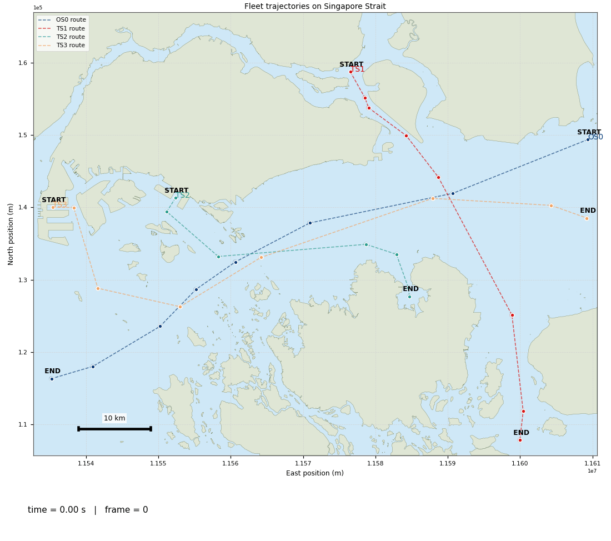
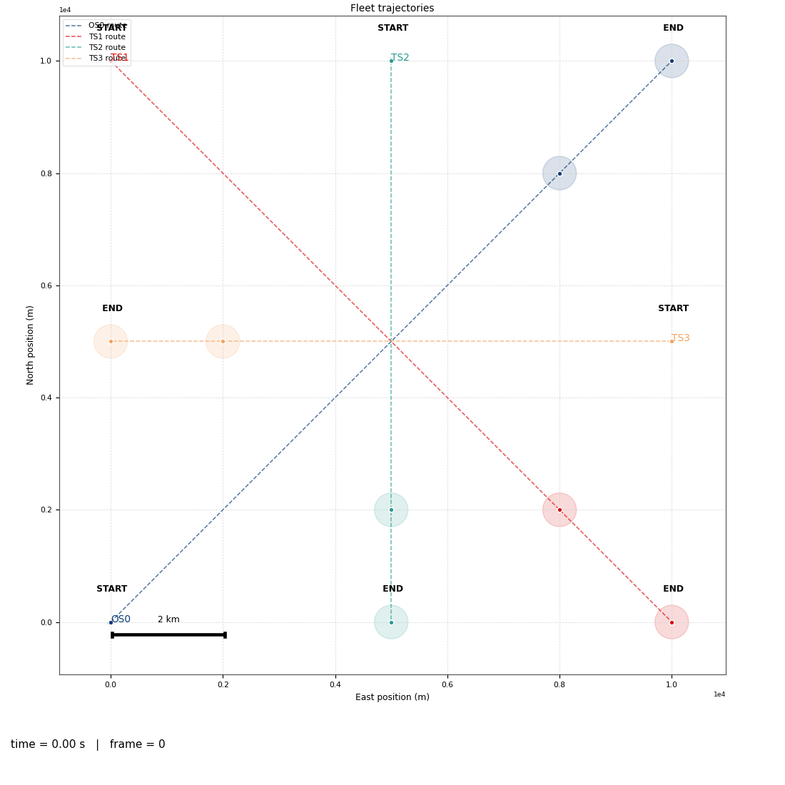
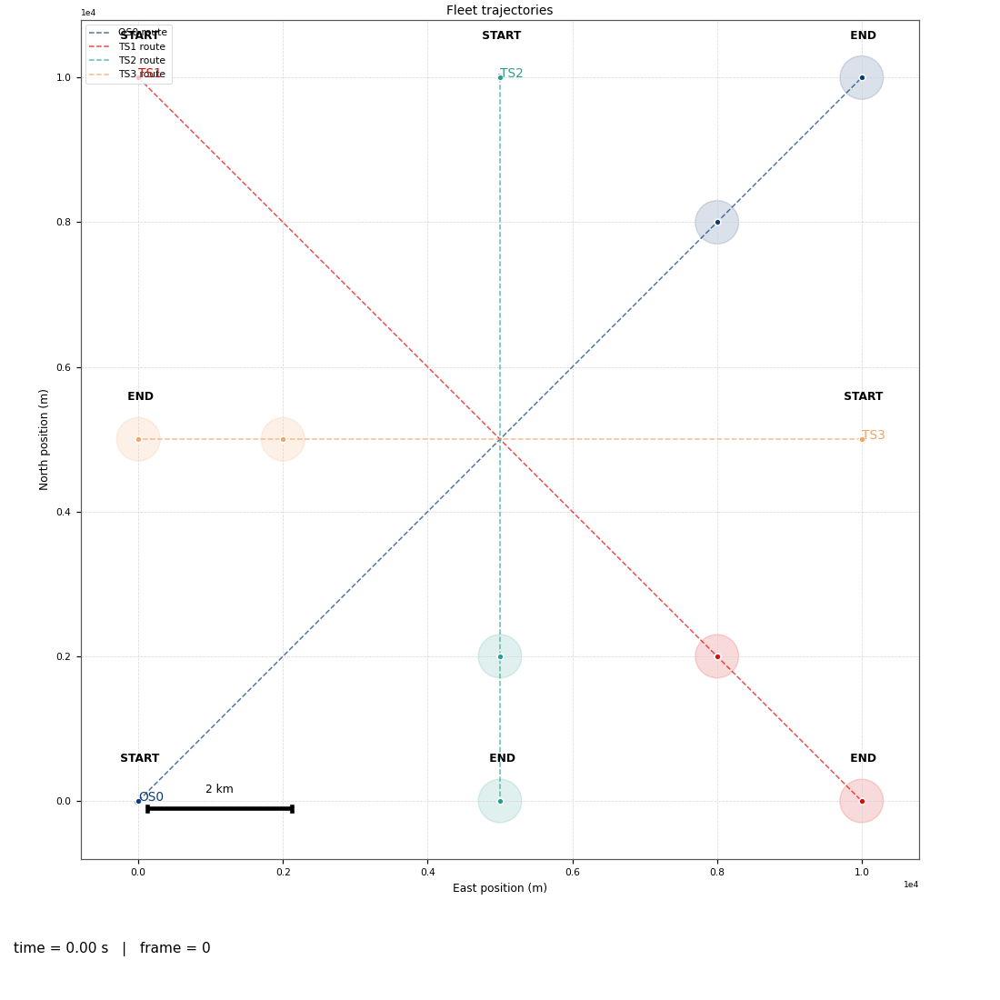
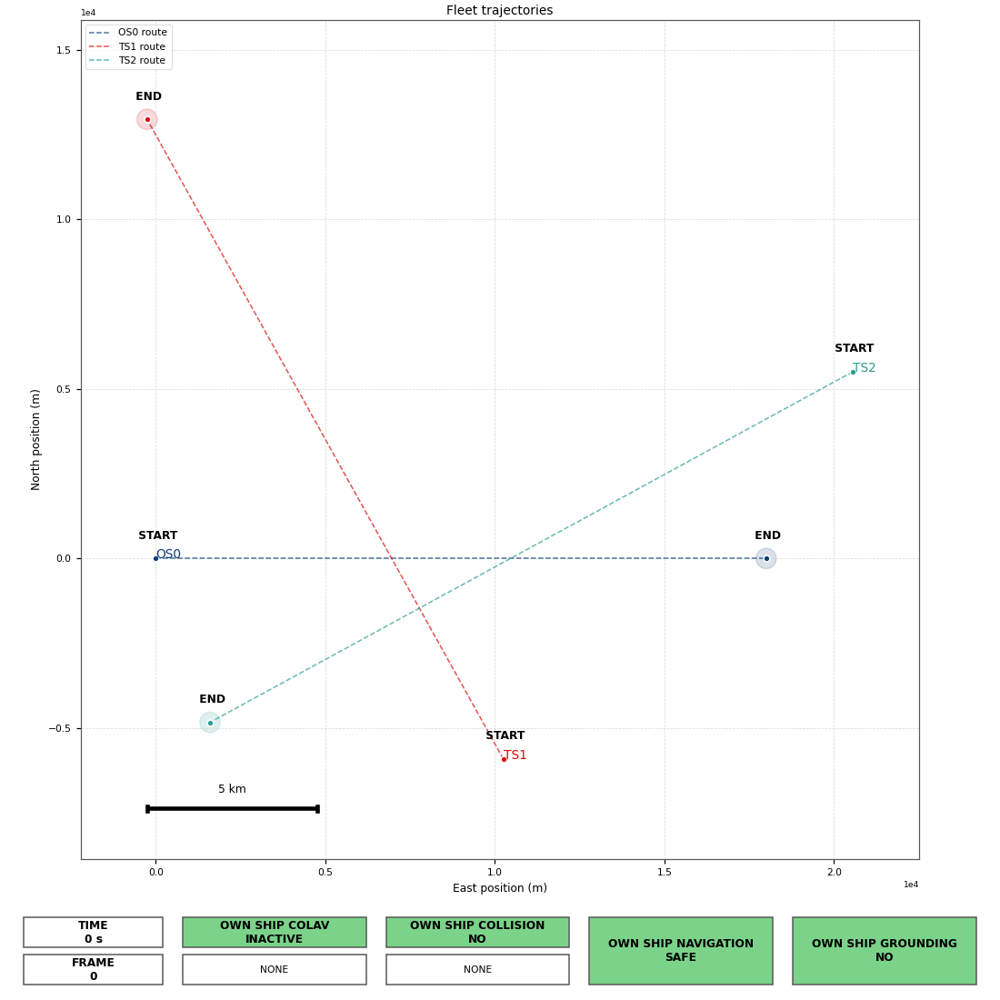

# Co-simulation Based Ship in Transit Simulator
Repository for Ship in Transit simulator in Co-simulation form.


## `Conda` Environment Setup [Simulator Only]

First clone the repository. Make sure `Conda` is installed. Then, set up the `Conda` environment by running this command in terminal:

```bash
conda env create -f environment.yml
```

The created `Conda` environment already includes the `libcosimpy` package, which is used to orchestrate and manage the execution of the `FMUs` within the co-simulation framework. It also includes `pythonfmu` library to enable users to create and package their own FMUs.

This simulator includes real-map support, using [OpenStreetMap (OSM)](https://www.openstreetmap.org/) API.This feature allows the simulator to:
* Plot real geographic regions anywhere on the globe
* Access and interact with the underlying topological map data
* Incorporate realistic environmental constraints into the simulation. 

The implementation relies on several geospatial Python libraries, including:
* `osmium`
* `osmnx`
* `geopandas`
* `shapely`
* `pyproj`

Additionally `matplotlib` and `pandas` are required for visualization and data handling (these are already included in the `environment.yaml`).

This setup is sufficient to run the simulator immediately. No additional installation steps are required if you intend to run the simulator without animation support.

### Enabling animation visualization
This simulator also supports animation visualization. However it requires `FFmpeg` module to **save** the animation as a file with video extension. Specifically on Windows, please refer to this [WikiHow](https://www.wikihow.com/Install-FFmpeg-on-Windows) page for the `FFmpeg` installation guide.

## Dependencies for Adaptive Stress Testing (Optional)

Only when you care about doing reinforcement learning-based process. Recommended to do these steps in order.

### Gymnasium
First, we need to install `gymnasium` to define the RL observation and action space, and wraps our custom RL-environment wrapper to comply with `stable-baselines3` package. Install this package by running:
```bash
pip install gymnasium
```

### Stable-Baselines 3
We also use `stable-baselines3`, which is a `pytorch`-compliant version for RL algorithms implementation. This package will be used as the core for our AST algorithm. Install this package by running:
```bash
pip install 'stable-baselines3[extra]'
```
To view the training process, `stable-baselines3` uses `tensorboard` using the `events.out.tfevents.*` file stored inside `<log_path>\tb`, commonly `trained_model\AST-train*\tb`. If not installed, we first need to install `tensorboard` by running:
```bash
pip install tensorboard
```
To view the charts, in the terminal first run:
```bash
tensorboard --logdir "<log_path>/tb"
```
While the terminal is running, go to the Tensorboard URL shown in the terminal. Commonly printed as: `http://localhost:6006/`. 
> **You can ignore the `TensorFlow installation not found` warning messages! Because we are using `PyTorch`**

### PyTorch
 We use `pytorch` to build the multi-layer perceptron network related with Reinforcement Learning (RL) implementaion for the AST. The onboard `pytorch` inside `stable-baselines3` only supports `cpu`-device. We need to reinstall it with the other `pytorch` version with `cuda` support to enable `cuda` acceleration for the training process. Please consult with [PyTorch official website](https://pytorch.org/get-started/locally/) for local installation guide. 
 
 Generally we need to uninstall the onboard `pytorch` from the previous `stable-baselines3` installation by running:
```bash
pip3 uninstall torch torchvision
```
 
 This model is developed on Windows OS, using CUDA 12.6-compliant NVIDA GPU. Install this package by running:
```bash
pip3 install torch torchvision --index-url https://download.pytorch.org/whl/cu126
```

### Traffic Generator
We also use `traffic generator` as a tool for generating a structured set of encounters for verifying automatic collision and grounding avoidance systems. This works is developed by DNV and, the original work can be found in *dnv-opensource* repo, [here](https://github.com/dnv-opensource/ship-traffic-generator.git). To install `traffic generator`, run this command in your terminal:
```bash
pip install trafficgen
```

---

##  Ship in Transit Co-simulation

The **ship-in-transit co-simulation** is a modular Python-based co-simulation framework for modeling and running transit scenarios of a marine vessel. It includes ship dynamics, machinery system behaviors, navigation logic, and environmental effects each in a form of a Functional Mockup Unit (`FMU`).

Think of `FMU` as a seperate sub-simulator describing a sub-system that can be simulated independently. Using `libcosimpy`, we can orchestrate all of these `FMUs` in harmony into a single complex system simulated as one entity.

This simulator includes several FMU groups, which are:
* **[Ship](FMUs/ship/)** (*with Machinery System*)
* **[Simplified Ship](FMUs/simplified_ship/)** (*without Machinery System*)
* **[Environmental Loads](FMUs/env_loads)** (*Wind and Current*)

This simulator is developed based on Ship in Transit Simulator created by **Børge Rokseth** (**borge.rokseth@ntnu.no**). Original simulator can be found [here](https://github.com/BorgeRokseth/ship_in_transit_simulator.git).

---

# Setting Up the Ship-in-Transit Co-Simulation
The simulator is executed through `main.py`. Two entry points exist:
-   a **general example `main.py`** located at the project root
-   a **simulation run with map included** located in `test_run/`

In general, running the Ship-in-Transit simulator follows the workflow below.

### 1. Prepare Configuration Files
Create the required `.yaml` configuration files that define:
-   simulation parameters
-   ship configurations
-   routes and mission setup

Refer to this configuration [guide](config/README.md) for details. These configuration files describe how the simulator and individual ships are constructed.

### 2. Load the Configuration
Load the configuration file and parse it into a Python dictionary. Typical workflow:
1.  Specify the path to the `.yaml` configuration file
2.  Open the file
3.  Parse the YAML contents into a Python dictionary

This dictionary will then be used to construct the co-simulation environment.

### 3. (Optional) Define Spawn Requests
Ships can be initialized directly through the YAML configuration using predefined routes and spawn locations. However, the simulator also supports **spawn requests**, which allow modification of:
-   initial position
-   start time
-   speed setpoints

after the configuration has been loaded.

This is particularly useful when running:
-   optimization algorithms
-   reinforcement learning
-   scenario generation
where the initial conditions must vary between simulation runs.


## 4. Instantiate the Co-Simulation Orchestrator
Create the main simulator instance using `ShipInTransitCosimulation`. Direct link to the script is [here](orchestrator/sit_cosim.py). The detailed behavior of the `ShipInTransitCosimulation` class is documented [here](orchestrator/README.md).  This class acts as the **central orchestrator** responsible for:
-   initializing ship subsystems
-   coordinating FMU components
-   managing simulation time progression
-   handling inter-component communication
-   plot and animation


## 5. Run the Simulation
To execute a single simulation run

    instance.Simulate() 
    
The simulation runs until the configured stop condition is reached.

## 6. Custom Simulation Run
You could also do a custom simulation run instead of running `instance.Simulate()`. Below is the rough skecth of it:

```python
while instance.time <= instance.stopTime:

    ## <<< INSERT LOGIC HERE

    instance.step()

    ## <<< OR INSERT LOGIC HERE

    if not instance.stop:
        instance.time += instance.stepSize
    else:
        break
```

## 7. Visualize the Results
After the simulation completes, several visualization tools areavailable.

### Fleet Animation
To generate an animated playback of ship motion run 

    instance.AnimateFleetTrajectory() 
This produces a dynamic animation of ship trajectories during the simulation.


### Static Trajectory Plot
To visualize ship routes on a static map run 

    instance.PlotFleetTrajectory()
This displays the full trajectory of each vessel until the simulation stops.

### Time-Series Plots
To visualize simulation outputs over time run

    instance.JoinPlotTimeSeries(key_group_list) 
`key_group_list` allows grouping multiple signals into the same plot. This is particularly useful when signals share the same unit (e.g., speed, heading, forces).

Time-series can be plotted:
-   individually
-   combined within the same figure
depending on the selected options.


## Typical Workflow Summary
The typical process for running the simulator:
1.  Prepare YAML configuration
2.  Load configuration
3.  (Optional) apply spawn requests
4.  Instantiate `ShipInTransitCosimulation`
5.  Run `instance.Simulate()`
6.  Visualize results (animation, trajectory plots, time-series)

---

# Ship in Transit Co-simulation Features
## 1. Ship Condition Evaluation

During simulation, ship conditions are continuously evaluated using the `evaluate_ship_condition()` method implemented in the `ShipInTransitCoSimulation` class. The`evaluate_ship_condition()` calls condition checking function `orchestrator/check_condition.py` to asses the condition, then outputs the boolean flag according to these assesments.

These conditions are used to detect important events that occur during simulation runtime. Some of these conditions are classified as **termination conditions**, meaning that when triggered, the simulation will **stop**.


### Condition Overview

| Condition Name        | Description | Evaluation Function (Inputs) | Termination |
|----------------------|------------|------------------------------|-------------|
| `grounding` | When a circular region based on `ship_length` around the ship position intersects with any land polygon in the map | `check_condition.is_grounding(land_poly, pos, ship_length)` | `True` (all ships) |
| `outside_horizon` | When a circular region based on `ship_length` around the ship position intersects with the map frame boundary | `check_condition.is_ship_outside_horizon(frame_poly, pos, ship_length)` | `True` (Own Ship), `False` (Target Ships) |
| `navigational_failure` | Triggered when the ship remains in a `navigational_warning` state for a certain time. Warning occurs when *cross-track error* exceeds threshold. Timer resets if ship recovers | `check_condition.is_ship_navigation_warning(e_ct, e_tol)` | `True` (all ships) |
| `reaches_end_waypoint` | When the ship enters the *Radius of Acceptance (RoA)* of the final waypoint | Implemented inside `MISSION_MANAGER` `FMU` | `True` (Own Ship), `False` (Target Ships) |
| `colav_active` | Activated when another ship is within proximity of a ship equipped with COLAV | Implemented inside `COLAV` `FMU` | `False` (all ships) |
| `collision` | When distance between two ships is smaller than the minimum allowed distance | `check_condition.is_ship_collision(own_pos, tar_pos, minimum_ship_distance)` | `True` (all ships) |

> ⚠️ **MAP EVALUATION IS COMPUTATIONALLY HEAVY!**  
>
> Checking `grounding` and `outside_horizon` is computationally heavy because it involves geometric intersection checks with `Shapely` polygon data from map files. Disable this process by setting `skip_map_evaluation=True` when instantiating the simulation if you are confident that ship assets will not run aground. This is already the default behavior. **You will know it when you really need it!**

### Example

```python
instance = ShipInTransitCoSimulation(
    config=config,
    ROOT=ROOT,
    spawn_requests=spawn_requests,
    skip_map_evaluation=True            # <- Set to False if you want to enable map evaluation process!
)
```

## 2. Importing Route and Map from Open Street Map

The repository provides utilities for importing and visualizing **real-world maps** from [OpenStreetMap (OSM)](https://www.openstreetmap.org/). These are primarily used to define simulation areas and plan ship routes within realistic maritime environments.

### Overview

The **map import system** is designed to integrate OSM-based geographic data with the ship simulator.   Using this, users can:
- Load real coastal or harbor maps as simulation backdrops.  
- Define navigable areas and obstacles based on OSM geometry.  
- Combine OSM-derived maps with manually added obstacles for detailed scenario definition.

### Workflow

#### 1. Prepare the Map File
   - The repository provides tools to extract OSM data and save it as a `.gpkg` (GeoPackage) file.  
   - Each layer in the `.gpkg` file (e.g., “frame”, “coast”, “waterways”) corresponds to different spatial elements used by the simulator.
   - Consult to `map_route_plotter` guide [here](map_route_plotter/README.md) for generating your own `.gkpg` file.

#### Load Map in the Simulator
   - Use helper functions from `utils.prepare_map` such as:
     ```python
     from map_route_plotter.prepare_map_route import get_gdf_from_gpkg
     (
            self.frame_gdf, self.ocean_gdf, self.land_gdf, self.coast_gdf,
            self.water_gdf, self.waterways_gdf, self.ferry_routes_gdf,
            self.harbours_gdf, self.bridges_gdf, self.tss_gdf, self.docks_gdf
        ) = get_gdf_from_gpkg(
            gpkg_path,
            frame_layer,
            ocean_layer,
            land_layer,
            coast_layer,
            water_layer,
            waterways_layer,
            ferry_routes_layer,
            harbours_layer,
            bridges_layer,
            tss_layer,
            docks_layer,
        )
     ```
   - The map geometry is read using `geopandas` and can be directly visualized or used in the environment setup.

#### Define and Visualize Routes
   - Route files (typically in `.txt`) define the waypoints of the ship’s mission.  
   - These can be plotted together with the map using:
     ```python
     from orchestrator.utils import get_map_path, get_ship_route_path_from_group, get_map_path
     ```
   - Visualization scripts are provided in `map_plot_route/plot_map_route.py` [script](map_route_plotter/plot_map_route.py).

#### Typical Use Case
   - Extract the simulation region of interest from OSM.  
   - Generate a `.gpkg` file containing relevant boundaries and water areas.  
   - Load the map into the simulator and overlay route waypoints to verify the navigation corridor.

#### File Structure Example
   ```
   data/
   ├── map/
   │   ├── oslo_fjord.gpkg
   │   ├── sinagpore_strait.gpkg
   │   └── ...
   └── route/
       ├── oslo_fjord/
       │   ├── of_route_0.txt
       │   ├── of_route_1.txt
       │   └── ...
       ├── singapore_strait/
       │   ├── ss_route_0.txt
       │   ├── ss_route_1.txt
       │   └── ...
       └── ...
   ```

#### Supported Layers
   The imported `.gpkg` may include:
   - **Frame**: Simulation area boundary  
   - **Ocean**: Ocean backgrounds
   - **Land**: Islands, piers, or restricted areas  
   - **Coast**: Coastline
   - **Waterways**: Navigable waterways (rivers/channels)
   - **Ferry Routes**: Trajecory line for ferry routes
   - **TSS**: Traffic Seperation Scheme
   - **Bridges**: Line showing bridges
   - **Docks**: Show dock
   - **Harbour**: Show harbour

## 3. Delayed Start
The **Delayed Start** mechanism allows a target ship to begin its simulation **at a time later than `t = 0`**. This is useful when modeling scenarios where vessels **enter the simulation domain after the simulation has already started**, such as:
-   ships entering a traffic lane later
-   encounter scenarios generated during optimization
-   reinforcement learning environments where ships spawn dynamically

### Why a Delayed Start Protocol is Needed
In the co-simulation architecture, the orchestrator interacts only with **FMUs (Functional Mock-up Units)**. The orchestrator itself does not contain semantic information about which FMUs belong to a particular ship. Instead, it only sees a **flat collection of FMUs** participating in the co-simulation.

Because of this, we need an additional protocol that allows the orchestrator to determine:
-   which FMUs belong to which ship
-   when a ship should begin participating in the simulation

### Ship FMU Naming Convention
Each ship consists of multiple FMUs representing subsystems (e.g., navigation, propulsion, control). To associate FMUs with their corresponding ship, a **naming convention** is used.

Each FMU name begins with a **ship identifier prefix** followed by
`"__"`. Examples:

    OS0__[FMU_NAME]  -> Own Ship
    TS1__[FMU_NAME]  -> Target Ship 1
    TS2__[FMU_NAME]  -> Target Ship 2
    TS3__[FMU_NAME]  -> Target Ship 3
    ... and so on ...
This prefix allows the orchestrator to group FMUs that belong to the same ship.

Ideally, the simulation contains <u>one</u> **own ship** that represents the *ship of interest* (or the *system under stress* in stress-testing scenarios). Consequently, all other ships are treated as **target ships**. This convention should be consistently maintained when working with the simulator.

### How Delayed Start Works
When a target ship has a delayed start time `t_start`, its FMUs are **still stepped by the co-simulation engine** during the early simulation phase. However, their inputs are **masked** so that the FMUs do not evolve in a meaningful way.

The purpose of this masking is to ensure that the ship:
-   remains stationary
-   does not produce unintended dynamics
-   does not interfere with the simulation before its start time

In practice, this means that **all inputs to the FMUs belonging to that ship are overridden with safe placeholder values** until the simulation time reaches the delayed start marker.

Conceptually:

    if simulation_time < ship_start_time:
        apply masked inputs to ship FMUs
    else:
        apply real inputs to ship FMUs

| No Delayed Start                                       | Delayed Start                                  |
|--------------------------------------------------------|------------------------------------------------|
|  |  |


### Masking Behavior
The masking typically enforces conditions such as:
-   zero propulsion commands
-   neutral rudder angle
-   zero control signals
-   frozen navigation commands

As a result, even though the FMUs are stepped, the ship **remains effectively inactive** until the delayed start time is reached.

### Implementation
The masking protocol is implemented through the helper function:

    get_masked_input_val_for_delayed_ship()

This function determines the appropriate masked input values that should be applied to each FMU input variable when the ship is still in its delayed start phase.

Once the simulation time exceeds the delayed start threshold, the masking is removed and the FMUs begin receiving their normal inputs,
allowing the ship to evolve dynamically within the simulation. 

## 4. Ship Traffic Generator

**Ship Traffic Generator** (STG) is a tool developed by DNV to generate a structured set of encounter scenarios for verifying automatic collision and grounding avoidance systems. The original implementation can be found in https://github.com/dnv-opensource/ship-traffic-generator. The version implemented in this simulator is simplified to be compatible with the Ship in Transit Co-Simulation algorithm.



Special thanks to **Melih Akdağ** (melih.akdag@dnv.com) for providing implementation examples.

> ⚠️ **NOT THOROUGHLY TESTED!**  
>
> This feature is still unstable and needs more improvement. At the moment, only works with simulation cases without OSM map.

### How It Works

Using the function:

```python
prepare_config_and_spawn_requests_with_traffic_gen()
```

located in:

```text
orchestrator/scenario_config.py
```

we generate two outputs:

- `config`
- `spawn_requests`

These are the fundamental inputs required by `ShipInTransitCoSimulation`.

#### Workflow Comparison

**Before:**

```text
spawn_requests + config -> simulation
```

**Now:**

```text
STG -> spawn_requests (encounter scenario)
spawn_requests + config -> simulation
```

This enables automatic generation of encounter scenarios instead of manually crafting `spawn_requests`.

### Important Notes

Because spawn requests are generated automatically, the config YAML does **not** need to include:

- `route_filename`
- `route`
- `spawn`

For the Own Ship, the following fields can optionally be specified:

- `sogMax`
- `mmsi`
- `shipType`

If these fields are not specified, default values will be used.

Please consult [`config/README.md`](config/README.md) for more details on the required Ship Traffic Generator config YAML fields.

### Function Inputs

`prepare_config_and_spawn_requests_with_traffic_gen()` requires four inputs:

a. `own_ship_initial`
b. `encounters`
c. `config_path`
d. `encounter_settings_path`

#### a. `own_ship_initial`

`own_ship_initial` defines the initial condition of the Own Ship.

In this simulator, the Own Ship is always the object of interest, or the system under stress, where the testing revolves around the Own Ship.

```python
own_ship_initial = {
    "position": {
        "north": 0.0,
        "east": 0.0,
    },
    "sog": 10.0,    # m/s
    "cog": 0.0,
    "heading": 0.0,
    "navStatus": "Under way using engine",
}
```

##### Field Description

| Field | Description |
|---|---|
| `position.north` | Initial north position of the Own Ship. |
| `position.east` | Initial east position of the Own Ship. |
| `sog` | Speed over ground in m/s. |
| `cog` | Course over ground in degrees. |
| `heading` | Ship heading in degrees. |
| `navStatus` | Navigation status of the Own Ship. |

##### Available `navStatus` Values

- `"Under way using engine"`
- `"At anchor"`
- `"Not under command"`
- `"Restricted maneuverability"`
- `"Constrained by draft"`
- `"Moored"`
- `"Aground"`
- `"Engaged in fishing"`
- `"Under way sailing"`
- `"Reserved for future use"`

#### b. `encounters`

`encounters` defines the type of encounter associated with each Target Ship.

Example:

```python
encounters = {
    "TS1": {
        "desiredEncounterType": encounter_type_TS1,
        "vectorTime": 25.0,
        "beta": 2.0,
        "relativeSpeed": 1.2,
    },
    "TS2": {
        "desiredEncounterType": encounter_type_TS2,
        "vectorTime": 25.0,
        "beta": -3.0,
        "relativeSpeed": 1.2,
    },
}
```

##### Available `desiredEncounterType` Values

- `"head-on"`
- `"overtaking-give-way"`
- `"overtaking-stand-on"`
- `"crossing-give-way"`
- `"crossing-stand-on"`

##### Encounter Parameter Description

| Parameter | Description |
|---|---|
| `desiredEncounterType` | Type of encounter to generate for the Target Ship. |
| `vectorTime` | Time in minutes for the situation to evolve. This is the time from the start of the situation until the Target Ship is within a specific range of the Own Ship. |
| `beta` | Relative bearing between the Own Ship and the Target Ship, as seen from the Own Ship, in degrees. |
| `relativeSpeed` | Relative speed between the Own Ship and the Target Ship, as seen from the Own Ship. A value of `1.2` means the Target Ship speed is 20% higher than the Own Ship speed. |

#### c. `config_path`

`config_path` is the path to the configuration YAML file.

#### d. `encounter_settings_path`

`encounter_settings_path` is the path to `encounter_settings.json`. A default value is already provided to simplify this process. The recommended content for `encounter_settings.json` is:

```json
{
    "classification": {
        "theta13Criteria": 67.5,
        "theta14Criteria": 5.0,
        "theta15Criteria": 5.0,
        "theta15": [112.5, 247.5]
    },
    "relativeSpeed": {
        "overtakingStandOn": [1.5, 2.0],
        "overtakingGiveWay": [0.25, 0.75],
        "headOn": [0.5, 1.5],
        "crossingGiveWay": [0.5, 1.5],
        "crossingStandOn": [0.5, 1.5]
    },
    "vectorRange": [10.0, 30.0],
    "situationLength": 30.0,
    "maxMeetingDistance": 2.0,
    "commonVector": 5.0,
    "situationDevelopTime": 2.0,
    "disableLandCheck": true
}
```

### Example Usage

```python
from orchestrator.scenario_config import prepare_config_and_spawn_requests_with_traffic_gen

own_ship_initial = {
    "position": {
        "north": 0.0,
        "east": 0.0,
    },
    "sog": 10.0,
    "cog": 0.0,
    "heading": 1.0,
    "navStatus": "Under way using engine",
}

encounters = {
    "TS1": {
        "desiredEncounterType": "head-on",
        "vectorTime": 25.0,
        "beta": 2.0,
        "relativeSpeed": 1.2,
    }
}

config, spawn_requests = prepare_config_and_spawn_requests_with_traffic_gen(
    own_ship_initial=own_ship_initial,
    encounters=encounters,
    config_path=config_path,
    encounter_settings_path=encounter_settings_path,
)
```