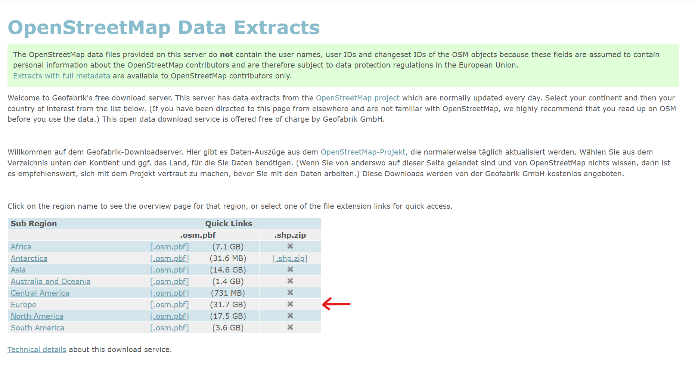
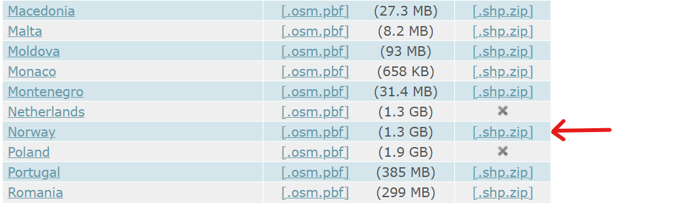
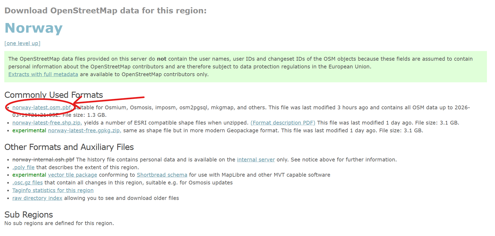
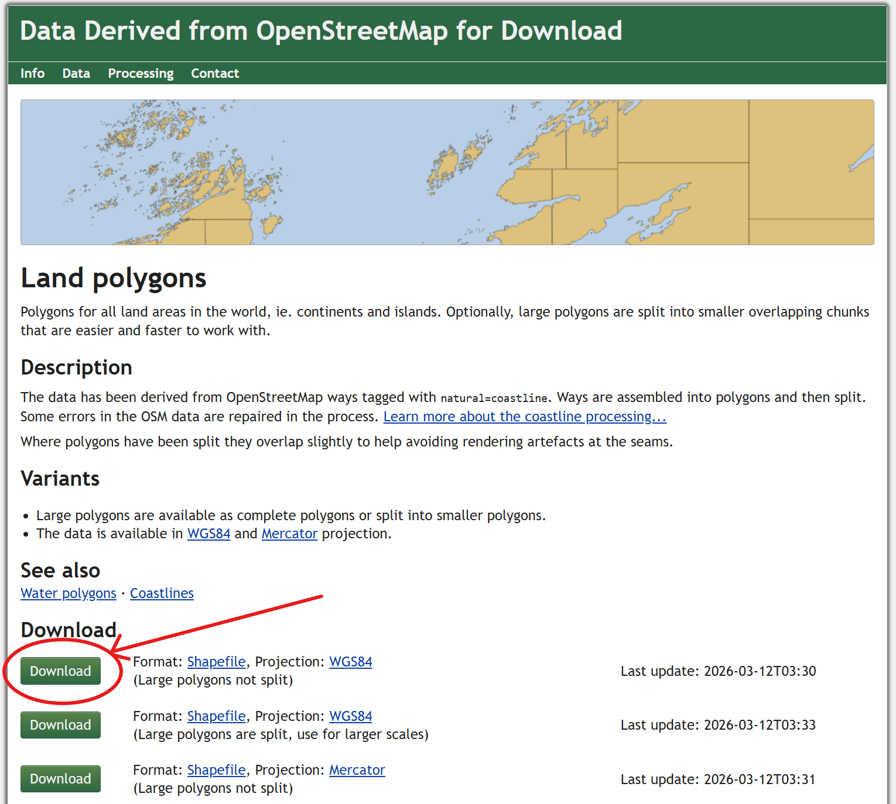
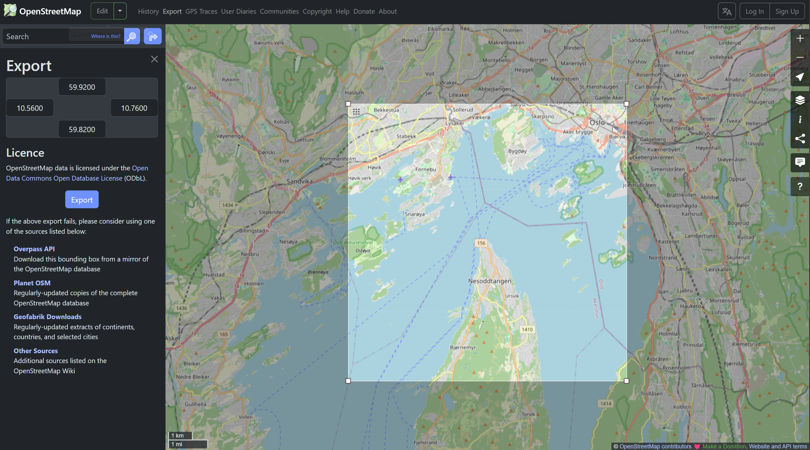

# Getting Map Data

This guide explains how to generate the map data required for the route planner.

The workflow consists of three main steps:

1.  Download raw OpenStreetMap data (`.osm.pbf`)
2.  Extract the region of interest
3.  Convert the data into a GeoPackage (`.gpkg`) used by the application

------------------------------------------------------------------------

## 1. Download OpenStreetMap Data

First download the raw OpenStreetMap data for the region of interest.

Visit:

https://download.geofabrik.de/

Steps:

1.  Navigate through the region hierarchy:

```{=html}
continent → country → subregion/province (if any)
```

Example:

    Europe → Norway


**First page:**



**Second page:**



2.  Download the `.osm.pbf` file.

Example:

    norway-{release_number}.osm.pbf



This file contains all OpenStreetMap data for the selected region.

------------------------------------------------------------------------

## 2. Download Land Polygons

To correctly render coastlines and oceans, you must download the global
**land polygon dataset**.

Download from:

https://osmdata.openstreetmap.de/data/land-polygons.html

Recommended file:

    land-polygons-complete-4326.zip



Extract the archive so that the following file is available:

    land_polygons.shp

This dataset is used to create the **land/ocean mask**.

------------------------------------------------------------------------

## 3. (Optional) Download Water Polygons

If you want additional inland water bodies such as lakes and reservoirs,
download:

https://osmdata.openstreetmap.de/data/water-polygons.html

Recommended file:

    water-polygons-split-4326.zip

------------------------------------------------------------------------

## 4. Extract the Area of Interest

The downloaded `.osm.pbf` file contains a large region.\
You must extract a smaller **Area of Interest (AOI)** using `osmium`.

General command:

    osmium extract -b <min_lon,min_lat,max_lon,max_lat> <input_file.osm.pbf> -o <output_file.pbf> --overwrite

Where:

    min_lon = western longitude
    min_lat = southern latitude
    max_lon = eastern longitude
    max_lat = northern latitude

These values can be obtained by opening this website: https://www.openstreetmap.org/export

Then try to set the bounding box for the region of interest that we want to capture in the website.

**Example (Oslo Fjord):**



    osmium extract -b 10.56,59.82,10.76,59.92 map_route_plotter/osm.pbf_data/norway-{release_number}.osm.pbf -o map_route_plotter/pbf_data/oslo_fjord.pbf --overwrite

------------------------------------------------------------------------

## 5. Convert `.pbf` to `.osm`

Next convert the extracted `.pbf` file into `.osm` format.

Command:

    osmium cat <input_file.pbf> -o <output_file.osm> -f osm -O

Example:

    osmium cat map_route_plotter/pbf_data/oslo_fjord.pbf -o map_route_plotter/osm_data/oslo_fjord.osm -f osm -O

------------------------------------------------------------------------

## 6. Convert `.osm` to `.gpkg`

The project uses **GeoPackage (`.gpkg`)** files for fast map loading.

1.  Open the script:

```{=html}
map_route_plotter/osm2gpkg.py
```

2.  Modify the `map_name` variable (around line 28) so that it matches
    your `.osm` filename **without the extension**.

Example:

    map_name = "oslo_fjord"

3.  Run the script:

```{=html}
python map_route_plotter/osm2gpkg.py
```

------------------------------------------------------------------------

## 7. Output Location

The generated GeoPackage will be saved to:

    root/data/map/

Example output:

    oslo_fjord.gpkg

This file is used by the route planner for rendering the map.

------------------------------------------------------------------------

## Summary of Workflow

    Download region .osm.pbf
            ↓
    Extract AOI using osmium
            ↓
    Convert .pbf → .osm
            ↓
    Run osm2gpkg.py
            ↓
    Generate map .gpkg

# Route Planner

This guide explains how to generate a route consisting of sequential waypoints using the interactive route planner and a prepared GeoPackage map.

The process uses an interactive `matplotlib` interface where the user
selects waypoints directly on the map.

------------------------------------------------------------------------

## Workflow

1.  Open the script:

```{=html}
map_route_plotter/route_planner.py
```

2.  Configure the output route filename by editing:

``` python
ROUTE_FILENAME = "route.txt"
```

The generated route file will be saved in:

    data/route/

3.  Specify the map file to use by setting the path to the GeoPackage:

``` python
GPKG_PATH = "path/to/map.gpkg"
```

This file should be generated previously using the `osm2gpkg.py` script.

------------------------------------------------------------------------

## Running the Route Planner

Run the script:

    python route_planner.py

An interactive map window will appear.


------------------------------------------------------------------------

## Creating Waypoints

1.  **Left-click on the map** to add a waypoint.

2.  Each click adds a waypoint to the route in the **same order as
    clicked**.

3.  Waypoints will appear with numbered labels indicating their order.

4.  Use the buttons at the bottom of the window to manage the route:

  | Button            | Function                                |
  |-------------------|-----------------------------------------|
  | **Undo**          | Remove the most recently added waypoint |
  | **Clear**         | Remove all waypoints                    |
  | **Finish & Save** | Save the route to file                  | 
  | **Cancel**        | Exit the planner without saving         |

------------------------------------------------------------------------

## Saving the Route

Once all desired waypoints are added:

1.  Click **Finish & Save**.
2.  Close the `matplotlib` window.

The route will be saved automatically to:

    data/route/<ROUTE_FILENAME>

Example:

    data/route/route.txt

------------------------------------------------------------------------

## Route File Format

The saved file contains waypoint coordinates in the following format:

    #Y/North, X/East
    <north> <east>
    <north> <east>
    ...

Each line represents one waypoint in projected map coordinates.

------------------------------------------------------------------------

## Tips

-   Plan the route carefully since waypoint order determines the
    navigation sequence.
-   Avoid placing waypoints on land if the route is intended for
    maritime navigation.